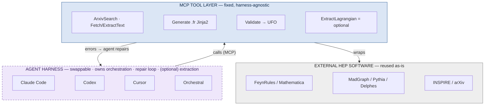
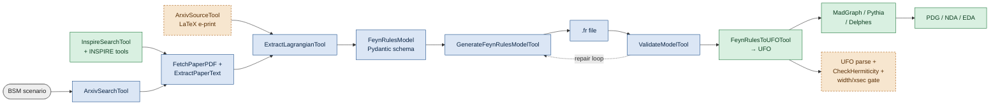

# Agentic Lagrangian Extraction from the Literature
### Midterm Progress Report & Technical Design

**Program:** Google Summer of Code 2026 · ML4SCI · HEPSIM5
**Contributor:** Ken Wu · **Mentors:** S. Mrenna (Fermilab), K. Matchev, A. Roman, T. Menzo (Alabama/Fermilab), I. Pang (Rutgers)
**Framework:** HEPTAPOD (`github.com/tonymenzo/heptapod`) · 350 hours · Advanced

> PDF: `GSOC_PROPOSAL.pdf` (compile with `latexmk -pdf GSOC_PROPOSAL.tex`).

---

## 1. Executive summary

The project automates a manual HEP bottleneck: turning a Beyond-Standard-Model
(BSM) scenario into a validated FeynRules `.fr` simulation model. Given a
scenario, an agent searches the literature, extracts the Lagrangian and its
conventions, generates a syntactically correct `.fr` file, and validates it.

The central design choice is to be **harness-agnostic by construction**: we did
not build an orchestrator. We built a layer of deterministic, schema-validated
**tools** (exposed via MCP) plus a workflow **prompt**. The "brain" that
sequences tools, reads their errors, and runs the repair loop is a general agent
harness — Claude Code, Codex, Cursor, or Orchestral — and it is **pluggable**
(§3.1). Reasoning stays where harnesses excel; the physics stays deterministic
and reproducible in tools.

**At midterm, the front half of the pipeline is built and tested**: literature
retrieval, schema-constrained Lagrangian extraction, and deterministic `.fr`
generation, plus a workflow prompt and a benchmark scaffold. The remaining half —
physics-level validation, benchmarking against reference implementations, and
extraction robustness — is scoped below. This report also folds in an adversarial
self-review that reshaped several design choices (§4–5).

## 2. Progress against the spec

| Spec item | Status | Notes |
|---|---|---|
| 1. Survey FeynRules models, catalog conventions | **gap** | Design informed by one reference model; a catalog *artifact* parsed from the FeynRules DB is the first second-half task. |
| 2. Tool modules (search / extract / `.fr` gen) | **done** | `ArxivSearchTool`, `FetchPaperPDFTool`, `ExtractPaperTextTool`; `ExtractLagrangianTool`; `FeynRulesModel` schema + `GenerateFeynRulesModelTool`. INSPIRE reused. Wired into `toolkit.yaml`; tests pass. |
| 3. Workflow: scenario → validated model | **partial** | Full workflow prompt + repair loop + Orchestral demo exist; one end-to-end live run + committed artifacts still to do. |
| 4. Validation (spectrum, gauge inv., widths/xsec) | **partial** | `ValidateModelTool` compiles `.fr`→UFO + checks files/particles. Gauge-invariance (FeynRules `CheckHermiticity`) and width/xsec reproduction are second-half (§5). |
| 5. Test vs FeynRules-DB benchmark models | **partial** | Eval scores vs hand-authored expectations; diffing against reference `.fr`/UFO (SLQrules, 2HDM, DMsimp) is the planned upgrade. |
| 6. Audit trail | **partial** | Detailed protocol in the prompt; making it tool-emitted (`audit.json`) is a small task. |
| **Expected results** (system + ≥2 validated models + audit + open code) | **partial** | Front half integrated + tested; validation-at-scale and an upstream PR remain. |

## 3. Architecture: a harness-agnostic tool layer

HEPTAPOD's philosophy — **deterministic, schema-validated tools; the LLM
orchestrates via MCP** — means we *reuse* HEPTAPOD's compilation/simulation tools
and build only the missing front half. No bespoke orchestrator, no vector-DB RAG
(the per-scenario corpus is small and equation-dense).

### 3.1 The harness boundary — what is swappable

Everything that is *reasoning* (deciding the next tool, reading a FeynRules
error, running the repair loop) belongs to a **swappable** agent harness.
Everything that is a *deterministic capability* (search, `.fr` generation,
compile/validate) stays a **fixed** tool. External physics software is reused.

- **The repair loop is the harness's job — and already is.** No hand-written
  repair control-flow: the loop is specified in the workflow prompt, and whatever
  harness runs it executes generate → validate → read error → fix → regenerate.
  The tools feed it structured errors (`GenerateFeynRulesModelTool` → Pydantic
  failures; `ValidateModelTool` → `{passed, checks[], feynrules_log}`) — exactly
  the edit→run→read-failure→fix loop coding agents do natively.
- **`ExtractLagrangianTool` is deliberately optional.** It embeds its own model
  call; when a capable coding-agent harness drives, the harness extracts the
  `FeynRulesModel` JSON itself. Keep the tool only for the headless/batch path
  (pinned model, reproducible benchmark numbers).
- **Two modes, same tools.** Interactive/demo/midterm → **Claude Code or Codex**
  (strongest models, native repair loop, visible). Reproducible benchmarking →
  **Orchestral / thin owned loop** (pinned model, logged traces). Swapping the
  driver is a config change (`claude mcp add` / `codex mcp add`), not a rewrite.

### 3.2 Workflow — what exists vs. what we build on top

🟩 existing HEPTAPOD (reused) · 🟦 built this term · 🟧 planned (second half)

All tools are exposed through HEPTAPOD's MCP server and driven by a coding-agent
harness (Claude Code / Codex) or the Orchestral web UI; every run records an
audit trail of sources, extracted terms, and decisions.

### Components: what exists vs. what we build on top

| Stage | Component | Status | Role / key tech |
|---|---|---|---|
| Harness | Claude Code / Codex / Orchestral | 🟩 existing | Swappable driver; owns orchestration + repair loop |
| Discovery | `InspireSearchTool` (+10 INSPIRE tools) | 🟩 existing | Citation-ranked metadata search; reused unchanged |
| Discovery | `ArxivSearchTool` | 🟦 built | arXiv Atom search (ids, PDF links, abstracts) |
| Ingestion | `FetchPaperPDFTool`, `ExtractPaperTextTool` | 🟦 built | Sandboxed PDF download (SSRF-guarded) + PyMuPDF full text |
| Ingestion | `ArxivSourceTool` (LaTeX) | 🟧 planned | Primary input from arXiv `.tex` e-prints (PDF math is lossy) |
| Extraction | `ExtractLagrangianTool` | 🟦 built (opt.) | Schema-constrained decode → `FeynRulesModel`; **optional** — a harness can extract directly |
| Schema | `FeynRulesModel` (Pydantic) | 🟦 built | Central artifact; numbers-as-strings preserve `-1/3`; Lagrangian verbatim |
| Generation | `GenerateFeynRulesModelTool` | 🟦 built | Deterministic Jinja2 → valid `.fr`; round-trips `S1_LQ_RR.fr` |
| Validation | `ValidateModelTool` | 🟦 built | Drives compile + structural checks (UFO files, particle presence) |
| Validation | `FeynRulesToUFOTool` | 🟩 existing | Mathematica/FeynRules `.fr`→UFO — the deterministic verifier; reused |
| Validation | real UFO parse + `CheckHermiticity` / spectrum | 🟧 planned | Gauge-invariance / symmetry checks as pass/fail |
| Validation | analytic width / cross-section gate | 🟧 planned | Reproduce known Γ, LO σ vs. published (tolerance) |
| Downstream | MadGraph / Pythia / Sherpa / Delphes | 🟩 existing | Event generation + detector sim; reused |
| Cross-checks | PDG, NDA, EDA (Diagrammatica) | 🟩 existing | Masses/widths, dimensional-analysis sanity checks |
| Orchestration | MCP server + Orchestral web UI | 🟩 existing | Exposes tools; streams calls; token/cost; stop/steer |
| Provenance | Audit trail (prompt) → `audit.json` tool | 🟦/🟧 | Records sources, terms, conventions, decisions |
| Benchmark | `eval` (scoring + runner) | 🟦/🟧 | Extraction recall / charge accuracy now; diff-vs-reference planned |

### Data flow and design decisions

The `FeynRulesModel` schema is the pipeline's spine: extraction **writes** it,
generation **reads** it, validation **checks** the compiled result against it.

- **Structure the error-prone blocks; carry the rest verbatim** — schema captures
  particles/quantum-numbers/parameters/indices with numbers as strings so `-1/3`
  survives; Lagrangian terms verbatim Mathematica (+ escape hatches).
- **Deterministic generation** — Jinja2 renders the `.fr`; the LLM never
  hand-writes Mathematica syntax.
- **Schema-constrained extraction** — output is well-formed or a repairable error.
- **Real verifier + repair loop** — `.fr`→UFO via FeynRules, then symmetry and
  width/xsec checks; the agent reads concrete errors and repairs.
- **Harness- and model-agnostic, auditable** — same MCP tools under Claude Code,
  Codex, or a local Ollama model, with a provenance trail.

## 4. Novelty and positioning

The **back half is not novel** and this report does not claim it: ColliderAgent
(arXiv:2603.14553) already automates LaTeX-Lagrangian → FeynRules → UFO →
MadGraph, and MadAgents (arXiv:2601.21015, v3) runs simulation campaigns from a
*user-supplied* PDF. Our contribution is the **front half**: model-name-driven
literature *discovery* (INSPIRE/arXiv) and extraction of the Lagrangian *and its
conventions* from retrieved paper text with per-term provenance, inside HEPTAPOD.
A second differentiator is architectural: ColliderAgent ships as
Claude-Code-specific *skills*, whereas our capability is a set of HEPTAPOD **MCP
tools** usable from any harness *and* from a reproducible headless loop (§3.1).
Related 2026 work, differentiated: `bsm_agent` (arXiv:2606.21316) constructs
Lagrangians from user-specified quantum numbers (de-novo, not from literature);
FERMIACC / "Albert" generate theories from *data* (SARAH, not FeynRules); Denario
(arXiv:2510.26887, linked by the mentors) is a general research-paper agent whose
modular design informs our audit-trail/search agents — not a model-file tool.
Three overlapping agentic-HEP systems appeared in H1 2026, so
extraction-with-provenance + convention normalization is the durable
differentiator.

## 5. Design revisions from an adversarial self-review

- **Ingest arXiv LaTeX source, not PDF text.** PDF math extraction is
  measurably weak (Nougat/olmOCR rank formulas the worst modality; PyMuPDF is
  worse). A `.tex` e-print ingestion tool (~1 week) becomes the primary input,
  PDF as fallback — also a differentiator (MadAgents still uses PDFs).
- **Re-scope 2HDM as "assisted."** The reference 2HDM is the general Higgs-basis
  model (matrix Yukawas, basis freedom, restriction files) — target the
  restricted CP-conserving type-II (`tanβ`, `sin(β−α)`) as assisted; keep
  **scalar leptoquark** and **scalar-singlet dark matter** as the two
  fully-automatic targets (satisfies "≥2 models").
- **Analytic decay-width reproduction is the primary physics gate.** Closed
  forms exist and are license-cheap: `Γ(S1→qℓ)=|y|²m_LQ/16π` (arXiv:1801.07641)
  and `Γ(h→SS)` (arXiv:1306.4710, whose factor-of-2 erratum is a designed test).
  Cross sections are a secondary LO-vs-LO gate with pinned PDF/scale/seed.
- **Plan around the Mathematica/FeynRules license.** FeynRules compilation +
  gauge checks need a license and can't run in public CI. Split: structural +
  published-UFO checks run license-free in CI; FeynRules compile runs on
  mentor/Fermilab infra.
- **Deepen validation.** Replace the name-substring UFO check with real
  `particles.py` parsing (name/PDG/charge/spin/color) + FeynRules
  `CheckHermiticity`/`CheckDiagonalKineticTerms`/`CheckMassSpectrum`.

## 6. Remaining plan (second half)

1. Ship the convention catalog (parse FeynRules-DB `.fr` files → doc + JSON).
2. Add the arXiv LaTeX-source extraction tool; run the pipeline end-to-end on
   scalar leptoquark and commit artifacts (audit, model JSON, `.fr`, UFO log).
3. Deepen `ValidateModelTool` (real UFO parsing + FeynRules symmetry checks) and
   add an analytic-width comparison tool.
4. Rebuild the benchmark to diff against reference DB implementations; report
   per-term extraction precision/recall (unmeasured by prior work).
5. Rebase onto upstream HEPTAPOD v2.2.0 (new `toolkit.yaml` schema) and open a
   PR; docs + worked examples.

## 7. Evaluation

- **Extraction accuracy:** per-term precision/recall + charge accuracy vs.
  reference FeynRules implementations (the §6.4 upgrade makes this literally so).
- **End-to-end validation pass rate:** fraction of models whose `.fr` compiles to
  a UFO *and* reproduces a known width/xsec within tolerance.
- **Reproducibility:** pinned reruns give a stable trace + `.fr`; a local open
  model reproduces the workflow (no vendor lock-in).

## 8. Risks

Extraction accuracy on real hep-ph prose (sign/normalization/chirality
conventions) is unmeasured — so measuring it is itself a contribution. Sign
errors can pass structural checks and only surface at the width gate, so
repair-loop convergence is the key unknown. The Mathematica license gates the
physics loop (mitigated by the CI split). Competitive convergence is real; the
discovery+provenance angle is the hedge.

## 9. Reproducibility

Code: HEPTAPOD fork, branch `feature/lagrangian-extraction`, registered in
`toolkit.yaml`/`test_runner.py`; five offline suites pass (live LLM/FeynRules
gated). Setup: `LAGRANGIAN_EXTRACTION_SETUP.md`; live-demo runbook: `DEMO.md`.
