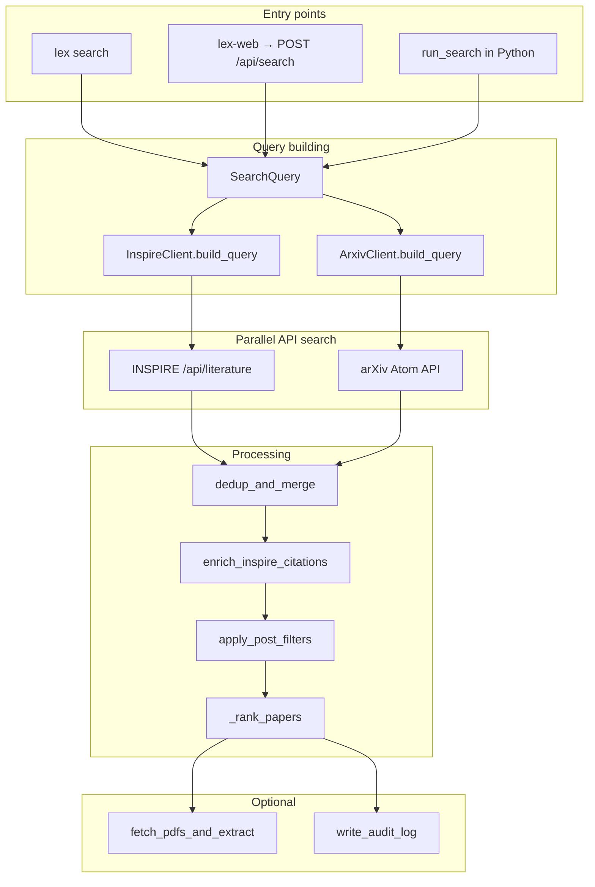

# Lagrangian Extraction — Architecture & Feature Guide

Stage 1 of the HEPSIM5 pipeline: search INSPIRE and arXiv, select **one theory paper** suitable for Lagrangian extraction, optionally download its PDF and extract plain text, and write a reproducible audit log.

---

## Table of contents

1. [Program flow (end-to-end)](#program-flow-end-to-end)
2. [Entry points](#entry-points)
3. [Module map](#module-map)
4. [Feature implementations](#feature-implementations)
5. [Data models](#data-models)
6. [Outputs](#outputs)
7. [Configuration](#configuration)

---

## Program flow (end-to-end)



### Step-by-step (`run_search`)

| Step | What happens | File |
|------|----------------|------|
| 1 | Build INSPIRE and arXiv query strings from `SearchQuery` | `pipeline/search.py` → `clients/inspire.py`, `clients/arxiv.py` |
| 2 | Open rate-limited HTTP client | `clients/_http.py` |
| 3 | Search INSPIRE and arXiv **in parallel** (thread pool) | `pipeline/search.py` |
| 4 | Parse API responses into `PaperRecord` lists | `clients/inspire.py`, `clients/arxiv.py` |
| 5 | Merge and deduplicate records | `pipeline/dedup.py` |
| 6 | Fill missing INSPIRE citation counts by arXiv ID | `pipeline/citations.py` |
| 7 | Apply client-side filters (theory, dates, exclude terms) | `pipeline/filter.py` |
| 8 | Rank candidates; take `top_k` + `runners_up` | `pipeline/search.py` → `pipeline/rank.py` or `pipeline/semantic.py` |
| 9 | Optionally download PDF and extract text (selected papers only) | `pipeline/pdfs.py` |
| 10 | Write JSON audit log | `pipeline/audit.py` |

The orchestrator is **`run_search()`** in `src/lagrangian_extraction/pipeline/search.py`. Everything else is called from there.

---

## Entry points

### 1. CLI — `lex search`

| Piece | Location |
|-------|----------|
| Argument parsing | `src/lagrangian_extraction/cli.py` |
| Builds `SearchQuery` + `Settings` | same file |
| Calls pipeline | `run_search(query, settings)` |
| Prints selected paper | `_print_selected_paper()` |

```bash
lex search "scalar leptoquark" -k BSM -k leptoquark --since 2015-01-01
```

### 2. Web UI — `lex-web`

| Piece | Location |
|-------|----------|
| Server launcher | `src/lagrangian_extraction/web/server.py` |
| FastAPI app + `/api/search` | `src/lagrangian_extraction/web/app.py` |
| HTML form | `src/lagrangian_extraction/web/static/index.html` |
| Browser logic | `src/lagrangian_extraction/web/static/app.js` |

Flow: browser submits JSON → `SearchRequest` → `_build_query()` → `run_search()` → `SearchResponse` JSON → UI renders selected paper.

### 3. Python API

```python
from lagrangian_extraction.models import SearchQuery
from lagrangian_extraction.pipeline.search import run_search

audit = run_search(SearchQuery(model_name="scalar leptoquark", keywords=["BSM"]))
paper = audit.selected_paper
```

---

## Module map

```
src/lagrangian_extraction/
├── cli.py                 # Typer CLI (lex search)
├── config.py              # Settings, rate limits, category constants
├── models.py              # SearchQuery, PaperRecord, AuditRun
├── utils.py               # normalize_arxiv_id, quote_search_term
├── clients/
│   ├── _http.py           # RateLimitedClient (token bucket + retries)
│   ├── inspire.py         # INSPIRE query builder, search, citation lookup
│   └── arxiv.py           # arXiv query builder, Atom feed parser
├── pipeline/
│   ├── search.py          # Orchestrator: run_search()
│   ├── dedup.py           # Merge INSPIRE + arXiv; dedup by ID/title
│   ├── citations.py       # enrich_inspire_citations()
│   ├── filter.py          # Theory filter + post-filters
│   ├── rank.py            # combined + relevance (extraction) ranking
│   ├── semantic.py        # Token cosine similarity ranking
│   ├── pdfs.py            # Download PDF + PyMuPDF text extraction
│   └── audit.py           # Atomic JSON audit log writer
└── web/
    ├── app.py             # FastAPI routes
    ├── server.py          # uvicorn entry (lex-web)
    └── static/            # index.html, style.css, app.js
```

---

## Feature implementations

### Single-paper selection (default `top_k=1`)

**Goal:** Pick one paper to extract a Lagrangian from, not a long ranked list.

| Concern | Implementation |
|---------|----------------|
| Default `top_k` | `models.SearchQuery.top_k = 1` |
| Wider search pool | `_fetch_pool_size()` returns `selection_pool_size` (50) when `top_k==1`, so ranking sees more candidates than it returns |
| Result fields | `AuditRun.selected_paper`, `AuditRun.candidates` (length ≤ top_k), `AuditRun.runners_up` |
| PDF download scope | Only `selected` papers passed to `fetch_pdfs_and_extract()` |

**Logic:** `pipeline/search.py` (lines 136–141, 143–150).

---

### Relevance ranking (`--sort relevance`, default)

**Goal:** Prefer model-building papers with Lagrangian content over generic reviews or collider searches.

| Signal | Weight (approx.) | Logic |
|--------|------------------|-------|
| Semantic match to model + keywords | 45% | `semantic_similarity()` in `pipeline/semantic.py` |
| Lagrangian heuristics | 25% | `_lagrangian_signal()` in `pipeline/rank.py` — boosts terms like “lagrangian”, “yukawa”; penalizes “review”, “TASI”, “search for” |
| INSPIRE citations (log-normalized) | ~20% | `compute_extraction_score()` |
| Recency (exponential decay) | 10% | half-life from `RankConfig.recency_half_life_years` |
| Has arXiv ID | small bonus | needed for PDF extraction |

**Entry:** `_rank_papers()` when `sort == "relevance"` (default) → `rank_for_extraction()`.

**File:** `src/lagrangian_extraction/pipeline/rank.py` — `compute_extraction_score()`, `rank_for_extraction()`.

---

### Other sort modes

| Mode | Behavior | File |
|------|----------|------|
| `combined` | Citation + recency only | `rank_candidates()` / `compute_score()` |
| `mostcited` | Sort by `citation_count` descending | `pipeline/search.py` |
| `mostrecent` | Sort by `published` descending | `pipeline/search.py` |
| `semantic` | Token cosine vs query text only | `rank_by_semantic()` in `pipeline/semantic.py` |

---

### Keyword search (`-k` / `--keywords`)

**Goal:** Match terms in **title and abstract**, not only INSPIRE’s sparse `k` metadata field.

#### INSPIRE (`clients/inspire.py`)

Per keyword, `_keyword_match_clause()` builds:

```
(abstracts.value:TERM OR ft TERM OR title TERM OR k TERM)
```

Multiple keywords are OR’d together and AND’d with the model clause.

Model name (keyword mode):

```
(title "model" OR abstracts.value:"model" OR ft "model")
```

#### arXiv (`clients/arxiv.py`)

Per keyword:

```
(ti:TERM OR abs:TERM)
```

Model name:

```
(ti:"model" OR abs:"model")
```

Category filter: `(cat:hep-ph ANDNOT cat:hep-ex ANDNOT cat:nucl-ex)`.

**Shared helper:** `utils.quote_search_term()` for multi-word phrases.

---

### Keyword negation (`-K` / `--exclude-keywords`)

#### API query layer

| Source | Clause |
|--------|--------|
| INSPIRE | `not (abstracts.value:TERM OR ft TERM OR title TERM OR k TERM)` per excluded term |
| arXiv | `ANDNOT (ti:TERM OR abs:TERM)` per excluded term |

**Files:** `InspireClient._exclude_keyword_clause()`, `ArxivClient.build_query()`.

#### Post-filter layer

After merge, `apply_post_filters()` drops papers whose title/abstract still contain excluded terms (with prefix matching for variants like supersymmetry / supersymmetric).

**File:** `pipeline/filter.py` — `_matches_keyword()`, `apply_post_filters()`.

---

### Author search & exclusion (`-a`, `-A`)

#### API query layer

| Source | Include | Exclude |
|--------|---------|---------|
| INSPIRE | `a "Author Name"` (AND across multiple) | `not a "Name"` |
| arXiv | `au:"Name"` (AND) | `ANDNOT au:"Name"` |

#### Post-filter layer

Requires all listed authors to appear in `paper.authors`; exclude if any excluded author name matches.

**Files:** `clients/inspire.py`, `clients/arxiv.py`, `pipeline/filter.py` — `_matches_author()`.

---

### Date filters (`--since`, `--until`)

| Source | Since | Until | Both |
|--------|-------|-------|------|
| INSPIRE | `date 2015+` | `date ->2020` | `date 2015->2020` |
| arXiv | `submittedDate:[YYYYMMDD TO …]` | same range | |

Post-filter also enforces `published` on `PaperRecord` when metadata is present.

**Files:** query builders in `inspire.py` / `arxiv.py`; `filter.py` for post-filter dates.

---

### Theory-only filter (`--theory-only`, default on)

**Goal:** Drop experimental papers (collider searches, etc.).

#### Query-time

| Source | Logic |
|--------|-------|
| INSPIRE | `not subject:Experiment-HEP` and `not subject:Experiment-Nucl` |
| arXiv | `cat:hep-ph` with `ANDNOT cat:hep-ex` and `ANDNOT cat:nucl-ex` |

Note: `subject:Theory-HEP` alone was too restrictive (many theory papers lack that tag).

#### Post-filter

`is_theory_paper()` in `filter.py`:

- Drops papers with `hep-ex`, `nucl-ex`, etc. (`config.EXPERIMENTAL_ARXIV_CATEGORIES`)
- Drops INSPIRE subjects like `Experiment-HEP`
- Keeps papers with theory categories/subjects or unknown metadata (not explicitly experimental)

**Constants:** `config.py` — `EXPERIMENTAL_*`, `THEORY_ARXIV_CATEGORIES`.

---

### Semantic search (`--search-mode semantic`)

**Goal:** Free-text query instead of structured title/keyword clauses.

| Layer | Behavior |
|-------|----------|
| INSPIRE query | Model string passed as plain text (no `title "..."` wrapper) |
| arXiv query | `all:"model name"` |
| Ranking with `--sort semantic` | Pure `semantic_similarity()` on title + abstract + authors |

**Semantic engine:** bag-of-words cosine similarity (`pipeline/semantic.py`). Not embedding-based; lightweight and dependency-free.

**Files:** `clients/inspire.py` / `arxiv.py` (`semantic=True` branch); `pipeline/semantic.py`.

---

### INSPIRE citation counts & zero-cite fix

**Problem:** arXiv Atom feed has no citation data → merged records showed `citation_count=0`.

**Solution:** After dedup, `enrich_inspire_citations()`:

1. Collect arXiv IDs where `citation_count == 0` or `inspire_id is None`
2. Batch-query INSPIRE: `eprint ID1 or eprint ID2 or …` (20 per request)
3. Merge citation count, inspire_id, subjects, abstract into existing records

**Files:**

- `pipeline/citations.py` — `enrich_inspire_citations()`
- `clients/inspire.py` — `lookup_by_arxiv_ids()`, `_parse_hit()` reads `citation_count`

INSPIRE is the **only** citation source; ranking and CLI display use `paper.citation_count` from INSPIRE.

---

### Deduplication (INSPIRE + arXiv)

When the same paper appears in both APIs, `_merge_records()` combines them:

| Field | Preference |
|-------|------------|
| Citations, inspire_id | Higher INSPIRE count / fill missing |
| PDF URL, categories | Often from arXiv |
| Title, abstract, dates | Fill gaps from either side |

Match keys (in order): normalized `arxiv_id`, DOI, title similarity ≥ 0.95.

**File:** `pipeline/dedup.py`.

---

### PDF download & text extraction

Only runs for **selected** papers when `download_pdfs=True`.

1. Download `https://arxiv.org/pdf/{arxiv_id}.pdf` to `data/pdfs/`
2. Validate PDF magic bytes; cache if unchanged
3. Extract text with PyMuPDF to `data/text/{arxiv_id}.txt`

**File:** `pipeline/pdfs.py` — `fetch_pdfs_and_extract()`.

---

### HTTP client & rate limiting

| Host | Limit (default) |
|------|-----------------|
| inspirehep.net | 15 requests / 5 s |
| export.arxiv.org, arxiv.org | 1 request / 3 s |

Retries on 429/5xx with exponential backoff (tenacity).

**File:** `clients/_http.py` — `RateLimitedClient`, `TokenBucket`.

---

### Audit trail

Every run writes `runs/{run_id}.json` atomically (write temp file, then rename).

Contains: full `SearchQuery`, API URLs, hit counts, `selected_paper`, `runners_up`, `candidates`, download results, errors, timestamps.

**File:** `pipeline/audit.py` — `write_audit_log()`.

---

## Data models

Defined in `src/lagrangian_extraction/models.py`:

| Model | Role |
|-------|------|
| `SearchQuery` | All user-facing search parameters |
| `PaperRecord` | Normalized paper metadata + `score` / `score_breakdown` |
| `AuditRun` | Full run state including `selected_paper` |
| `LocalPDF` | Per-download outcome (paths, pages, errors) |
| `RawSearchCounts` | inspire_hits, arxiv_hits, merged_unique |

---

## Outputs

```
runs/{run_id}.json     # Full audit (query, URLs, selected paper, errors)
data/pdfs/{arxiv_id}.pdf
data/text/{arxiv_id}.txt
```

---

## Configuration

`src/lagrangian_extraction/config.py`:

| Class | Purpose |
|-------|---------|
| `Settings` | Bundles paths, rate limits, rank config, HTTP user-agent |
| `RankConfig` | Citation/recency weights, `selection_pool_size=50`, semantic/lagrangian weights |
| `PathConfig` | `data/`, `data/pdfs/`, `data/text/`, `runs/` |
| `RateLimitConfig` | Per-host request windows |

---

## Testing

| Area | Tests |
|------|-------|
| INSPIRE client / queries | `tests/test_inspire.py` |
| arXiv client / queries | `tests/test_arxiv.py` |
| Dedup | `tests/test_dedup.py` |
| Ranking | `tests/test_rank.py` |
| Filters | `tests/test_filter.py` |
| Citations | `tests/test_citations.py` |
| Semantic | `tests/test_semantic.py` |
| End-to-end (mocked HTTP) | `tests/test_search_e2e.py` |
| Web API | `tests/test_web.py` |
| PDF extraction | `tests/test_pdfs.py` |

Run: `pytest -v` (36 tests; requires `[dev]` and `[web]` extras for web tests).

---

## What comes next (Stage 2+)

Not implemented yet:

- Chunking + vector index (ChromaDB)
- LLM extraction of Lagrangian terms
- FeynRules / MadGraph validation
- LaTeX source bundles from arXiv

See `HANDOFF.md` for a shorter continuation guide.
